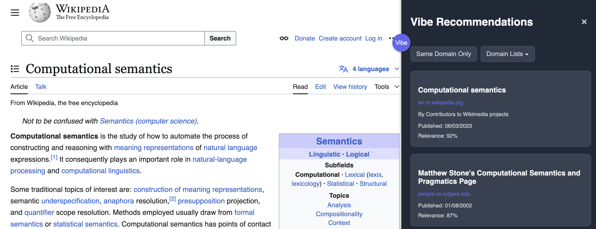

# Vibe Browser Extension

A browser extension that provides intelligent, contextual website recommendations while browsing. Using advanced semantic analysis, Vibe understands the content you're viewing and suggests relevant websites that match your interests.


## Screenshot



## Features

- **Smart Contextual Recommendations**: Get relevant website suggestions based on the content you're currently viewing
- **Domain Filtering Options**:
  - "Same Domain Only" toggle to see more from the current website
  - Custom domain lists to filter recommendations by your preferred domains
- **Seamless Integration**: Clean, minimal sidebar that adapts to the website layout

## Setup

1. Install dependencies:
   ```bash
   npm install
   ```

2. Configure your Exa API key:
   - Create a file `src/config.ts` based on `src/config.example.ts`
   - Add your Exa API key (you can get one by signing up at [Exa](https://exa.ai))
   ```typescript
   // src/config.ts
   export const config = {
     exaApiKey: 'YOUR_EXA_API_KEY_HERE',
   };
   ```

3. Build the extension:
   ```bash
   npm run build
   ```

4. Load the extension in your browser:
   - Chrome/Arc: Go to `chrome://extensions` or `arc://extensions`
   - Enable "Developer mode"
   - Click "Load unpacked"
   - Select the `dist` directory

## Usage

### Basic Navigation

1. Click the purple Vibe button in the top-right corner of any webpage to open the sidebar
2. Browse recommendations related to the content you're viewing
3. Click on any recommendation to visit that website
4. Close the sidebar by clicking the X or the Vibe button again

### Domain Filtering

- **Same Domain Only**: Toggle this option to see only recommendations from the current website
- **Domain Lists**: Create and manage custom lists of domains for filtering recommendations
  1. Click the "Domain Lists" dropdown
  2. Click "+ New List" to create a domain list
  3. Give your list a name and add domains (one per line)
  4. Select a list from the dropdown to filter recommendations to only those domains


## Development Workflow

- Run `npm run watch` to automatically rebuild on changes
- The extension will need to be reloaded in your browser after changes

## Project Structure

- `src/` - Source code
  - `popup/` - Extension popup for settings
  - `content/` - Content script (sidebar)
  - `background/` - Background script for API requests
  - `services/` - API and storage services
  - `config.ts` - Configuration (including API keys)
- `dist/` - Built extension
- `store-assets/` - Assets for Chrome Web Store
- `icons/` - Extension icons

## Security Note

The API key is stored in the `config.ts` file. When sharing your code or pushing to a public repository, make sure to:
1. Add `src/config.ts` to your `.gitignore` file
2. Use `src/config.example.ts` as a template with placeholder values
3. Never commit your actual API key

## License
MIT 